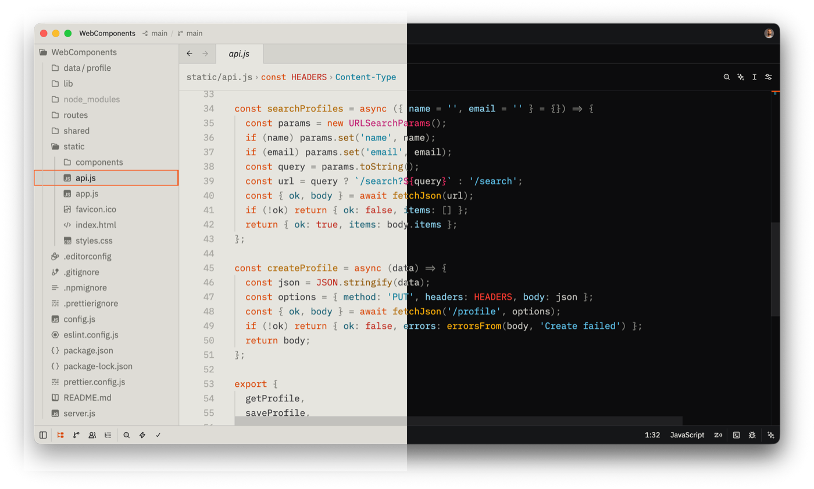
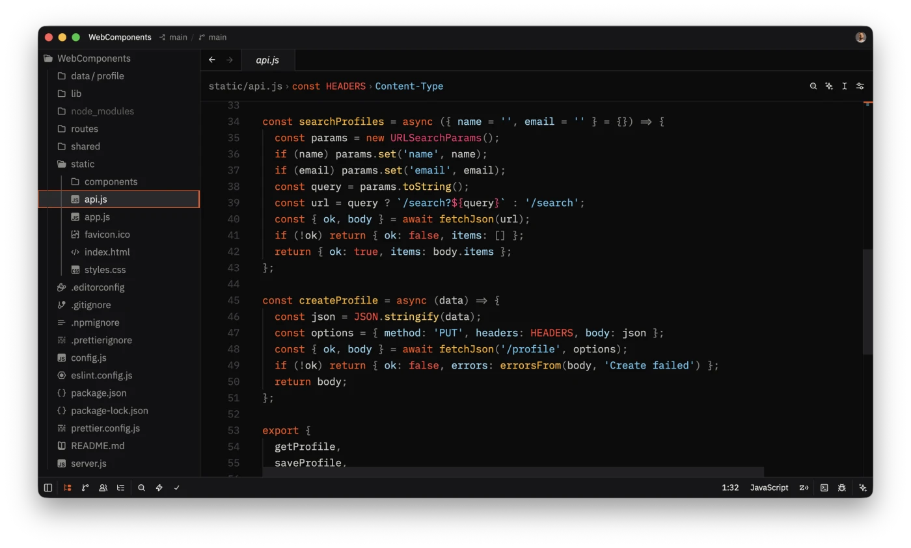
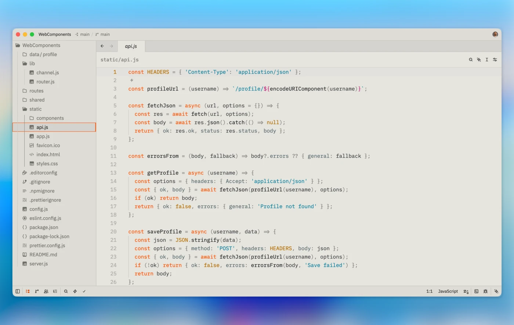

<h3 align="center">
	EP-133 for <a href="https://zed.dev/">Zed</a>
</h3>

	
	
	

	A Zed theme inspired by the <a href="https://teenage.engineering/products/ep-133">EP&ndash;133 K.O. II</a> from Teenage Engineering.

	

## Previews

<!-- Screenshots live in assets/ — see assets/README.md for the expected filenames & specs -->

EP-133 Display (dark)

EP-133 Chassis (light)

## Usage

1. Open Zed.
2. Open the command palette (<kbd>Cmd</kbd>+<kbd>Shift</kbd>+<kbd>P</kbd>) and enter _zed: extensions_.
3. Search for the _EP-133_ extension and install.
4. Enter _theme selector: toggle_ in the command palette and select **EP-133 Display** or **EP-133 Chassis** in the dropdown.

## Development

This theme is a hand-authored Zed theme (no generator). The theme definitions live in [`themes/ep-133.json`](themes/ep-133.json).

To test locally:

1. Open the command palette and enter _zed: install dev extension_, then select this repository.
2. Refresh with _zed: reload extensions_ after making changes. _workspace: reload_ may be needed if changes are not reflected immediately.

See the [Zed documentation](https://zed.dev/docs/extensions/developing-extensions) for more information.

### Publishing to the Marketplace

Pushing a `v*` tag triggers the [release workflow](.github/workflows/release.yml), which opens a pull request against your fork of [`zed-industries/extensions`](https://github.com/zed-industries/extensions). See the [Zed documentation](https://zed.dev/docs/extensions/developing-extensions#updating-an-extension) for more information.

	Copyright &copy; 2026-present <a href="https://github.com/evgenii-sergeev" target="_blank">Evgenii Sergeev</a>

	

